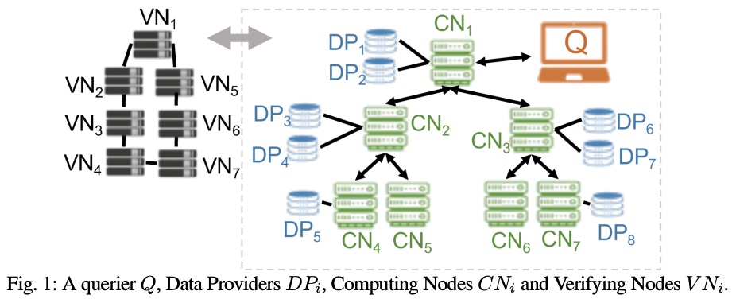

# Drynx demonstrator

Drynx is a decentralized system that can perform statistical analysis and machine learning on 
sensitive and distributed data while ensuring data confidentiality and privacy. It uses interactive protocols, 
homomorphic encryption, zero-knowledge proofs of correctness, and differential privacy to enable an efficient and 
decentralized verification of the input data and of all the system’s computations. Drynx is modular, dynamic, and 
parallelizable. The evaluation shows that Drynx can train a logistic regression model on a dataset (12 features and 
600,000 records) distributed among 12 data providers in less than 2 seconds, and the verification of the query 
execution’s correctness takes less than 22 seconds.

You can find more information in the [C4DT showcase entry](https://factory.c4dt.org/showcase/drynx).

## Running the demo

To run the demo, run

```
docker-compose up
```

The docker images are available for `linux/amd64` only, but using `Rosetta` makes them also work on mac with M1/M2
processors.

## Details about the article

Data sharing has become of primary importance in many domains such as big-data analytics, economics and medical 
research, but remains difficult to achieve when the data are sensitive. In fact, sharing personal information requires
individuals’ unconditional consent or is often simply forbidden for privacy and security reasons. In this paper, we 
propose Drynx, a decentralized system for privacy-conscious statistical analysis on distributed datasets.



Drynx relies on a set of computing nodes to enable the computation of statistics such as standard deviation or extrema, 
and the training and evaluation of machine-learning models on sensitive and distributed data. To ensure data 
confidentiality and the privacy of the data providers, Drynx combines interactive protocols, homomorphic encryption, 
zero-knowledge proofs of correctness, and differential privacy. It enables an efficient and decentralized verification 
of the input data and of all the system’s computations thus provides auditability in a strong adversarial model in which 
no entity has to be individually trusted.

Drynx is highly modular, dynamic and parallelizable. Our evaluation shows that it enables the training of a logistic 
regression model on a dataset (12 features and 600,000 records) distributed among 12 data providers in less than 2 
seconds. The computations are distributed among 6 computing nodes, and Drynx enables the verification of the query 
execution’s correctness in less than 22 seconds.

